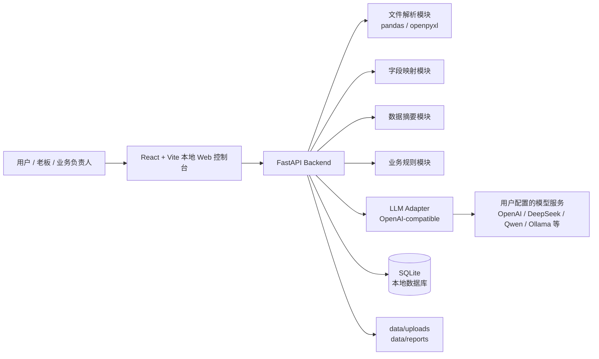

# GYUTRON Local Business Agent 技术架构文档

## 1. 架构目标

GYUTRON Local Business Agent 的第一版是本地部署的老板日报 Agent。架构必须支持本地文件导入、本地 SQLite 存储、可替换 LLM Provider、清晰的业务规则注入，以及后续扩展平台 API 和自动化工作流。

核心约束：

- 默认不做云端数据同步。
- 后端以 FastAPI 为业务核心。
- 前端以 React + Vite 提供本地 Web 控制台。
- 数据以 SQLite 和本地文件目录为主。
- LLM 通过 OpenAI-compatible adapter 调用，后续扩展其他 Provider。

## 2. 总体架构



## 3. 推荐项目目录结构

```text
gyutron-local-business-agent/
  AGENTS.md
  README.md
  docker-compose.yml
  .env.example
  docs/
    PRD.md
    ARCHITECTURE.md
    MVP_ROADMAP.md
    API.md
  backend/
    pyproject.toml
    alembic.ini
    app/
      main.py
      core/
        config.py
        database.py
        security.py
        logging.py
      api/
        v1/
          router.py
          endpoints/
            health.py
            uploads.py
            mappings.py
            reports.py
            rules.py
            llm_configs.py
      models/
        base.py
        upload.py
        field_mapping.py
        business_rule.py
        report.py
        llm_config.py
      schemas/
        upload.py
        field_mapping.py
        business_rule.py
        report.py
        llm_config.py
      services/
        file_parser.py
        field_detector.py
        mapping_service.py
        data_summary.py
        report_generator.py
        rule_engine.py
      llm/
        base.py
        openai_compatible.py
        factory.py
      repositories/
        uploads.py
        mappings.py
        rules.py
        reports.py
        llm_configs.py
      prompts/
        boss_daily_report.zh.md
      tests/
        test_file_parser.py
        test_field_detector.py
        test_report_generation.py
    migrations/
  frontend/
    package.json
    vite.config.ts
    src/
      main.tsx
      App.tsx
      api/
        client.ts
        uploads.ts
        mappings.ts
        reports.ts
        rules.ts
        llmConfigs.ts
      pages/
        DashboardPage.tsx
        UploadPage.tsx
        MappingPage.tsx
        ReportGeneratePage.tsx
        ReportHistoryPage.tsx
        RulesPage.tsx
        SettingsPage.tsx
      components/
        AppShell.tsx
        FileUploadPanel.tsx
        FieldMappingTable.tsx
        ReportViewer.tsx
        RuleEditor.tsx
      types/
        api.ts
      styles/
        globals.css
  data/
    uploads/
    reports/
    gyutron.sqlite3
  scripts/
    dev.ps1
    dev.sh
    seed_sample_data.py
  samples/
    inquiry_sample.csv
    order_sample.csv
```

说明：

- `data/` 是客户本地业务数据目录，应该加入 `.gitignore`。
- `samples/` 可以放脱敏演示文件，用于销售演示和测试。
- `docs/API.md` 在接口稳定后补齐。
- `security.py` MVP 阶段可以先预留，后续用于 API Key 加密和本地访问控制。

## 4. 后端模块设计

### 4.1 API 层

API 层只做请求校验、调用 service、返回响应，不直接包含复杂业务逻辑。

主要 Endpoint：

- `GET /api/v1/health`
- `POST /api/v1/uploads`
- `GET /api/v1/uploads/{upload_id}/preview`
- `POST /api/v1/mappings`
- `GET /api/v1/mappings`
- `POST /api/v1/reports/generate`
- `GET /api/v1/reports`
- `GET /api/v1/reports/{report_id}`
- `POST /api/v1/rules`
- `GET /api/v1/rules`
- `PATCH /api/v1/rules/{rule_id}`
- `DELETE /api/v1/rules/{rule_id}`
- `POST /api/v1/llm-configs`
- `GET /api/v1/llm-configs`
- `POST /api/v1/llm-configs/{config_id}/test`

### 4.2 文件解析模块

职责：

- 保存上传文件。
- 判断文件类型。
- 使用 pandas / openpyxl 读取表头和前 20 行。
- 推断列数据类型。
- 返回结构化 preview。

边界：

- 不在此模块生成报告。
- 不在此模块调用 LLM。
- 不把完整大表直接返回给前端。

### 4.3 字段检测模块

职责：

- 基于数据类型和列名猜测标准字段。
- 结合历史字段映射提高命中率。
- 生成候选映射和置信度。

MVP 可以先用规则引擎，不必一开始调用 LLM。规则包括：

- 中英文关键词匹配。
- 日期、邮箱、数字、金额、国家名称等类型推断。
- 已确认历史映射复用。

### 4.4 数据摘要模块

职责：

- 根据字段映射读取数据。
- 转换成标准业务记录。
- 计算日报所需摘要指标。
- 输出紧凑 JSON，供 LLM prompt 使用。

原则：

- LLM 输入应是摘要，不是完整原始表格。
- 摘要中保留足够样例和异常明细，便于生成可行动建议。

### 4.5 业务规则模块

职责：

- 管理用户自然语言规则。
- 根据数据类型筛选适用规则。
- 在报告生成时输出规则列表。

MVP 不需要把规则编译成复杂 DSL。可先把启用规则作为高优先级上下文注入 prompt，同时对少数确定性规则做程序化计算，例如：

- 超过 N 小时未回复询盘。
- 毛利率低于 N%。
- 库存低于安全库存。

### 4.6 报告生成模块

职责：

- 组装数据摘要、业务规则、报告日期范围、用户意图。
- 调用 LLM adapter。
- 处理失败和重试。
- 保存报告正文、摘要、元数据、规则快照和模型信息。

报告生成状态：

- `pending`
- `running`
- `succeeded`
- `failed`

MVP 可先同步生成，后续再引入任务队列。

### 4.7 LLM Adapter

第一版只实现 OpenAI-compatible adapter。

配置项：

- `provider_name`
- `base_url`
- `api_key`
- `model_name`
- `temperature`
- `max_tokens`
- `timeout_seconds`

接口：

```python
class LLMClient:
    def generate_text(self, messages: list[dict], **kwargs) -> str:
        ...
```

后续扩展：

- Claude adapter
- Gemini adapter
- Ollama adapter
- Azure OpenAI adapter

## 5. 数据库设计

MVP 推荐使用 SQLAlchemy + SQLite。表结构保持简单可迁移。

### 5.1 `llm_configs`

| 字段 | 类型 | 说明 |
| --- | --- | --- |
| `id` | integer | 主键 |
| `provider_name` | text | Provider 名称 |
| `base_url` | text | API Base URL |
| `api_key` | text | 本地保存的 API Key |
| `model_name` | text | 模型名称 |
| `temperature` | real | 温度 |
| `max_tokens` | integer | 最大输出 token |
| `is_default` | boolean | 是否默认 |
| `created_at` | datetime | 创建时间 |
| `updated_at` | datetime | 更新时间 |

正式商用前应对 `api_key` 做本地加密。

### 5.2 `uploads`

| 字段 | 类型 | 说明 |
| --- | --- | --- |
| `id` | integer | 主键 |
| `data_type` | text | 数据类型 |
| `original_filename` | text | 原始文件名 |
| `stored_path` | text | 本地保存路径 |
| `file_type` | text | csv/xlsx/xls |
| `file_size` | integer | 文件大小 |
| `header_signature` | text | 表头签名 |
| `row_count` | integer | 行数 |
| `status` | text | uploaded/parsed/failed |
| `error_message` | text | 错误信息 |
| `created_at` | datetime | 创建时间 |

### 5.3 `field_mappings`

| 字段 | 类型 | 说明 |
| --- | --- | --- |
| `id` | integer | 主键 |
| `upload_id` | integer | 关联上传 |
| `data_type` | text | 数据类型 |
| `source_column` | text | 原始列名 |
| `target_field` | text | 标准字段 |
| `confidence` | real | 置信度 |
| `status` | text | auto_mapped/user_confirmed/user_modified/ignored |
| `sample_values_json` | text | 样例值 |
| `created_at` | datetime | 创建时间 |
| `updated_at` | datetime | 更新时间 |

### 5.4 `business_rules`

| 字段 | 类型 | 说明 |
| --- | --- | --- |
| `id` | integer | 主键 |
| `name` | text | 规则名称 |
| `description` | text | 自然语言规则 |
| `data_type` | text | 适用数据类型，空值表示全局 |
| `priority` | integer | 优先级 |
| `is_active` | boolean | 是否启用 |
| `created_at` | datetime | 创建时间 |
| `updated_at` | datetime | 更新时间 |

### 5.5 `reports`

| 字段 | 类型 | 说明 |
| --- | --- | --- |
| `id` | integer | 主键 |
| `title` | text | 报告标题 |
| `report_type` | text | boss_daily |
| `date_range_start` | date | 开始日期 |
| `date_range_end` | date | 结束日期 |
| `status` | text | pending/running/succeeded/failed |
| `summary_json` | text | 数据摘要 |
| `content_markdown` | text | 报告正文 |
| `rules_snapshot_json` | text | 生成时使用的规则 |
| `uploads_snapshot_json` | text | 使用的数据集 |
| `llm_config_snapshot_json` | text | 模型配置快照，不保存完整 API Key |
| `error_message` | text | 错误信息 |
| `created_at` | datetime | 创建时间 |
| `updated_at` | datetime | 更新时间 |

## 6. 前端页面设计

### 6.1 页面

- **首页 Dashboard**：最近报告、最近上传、当前模型配置状态、快速生成日报入口。
- **数据导入 Upload**：选择数据类型、上传文件、查看解析状态。
- **字段映射 Mapping**：表头、样例值、系统猜测、用户选择目标字段。
- **生成日报 Report Generate**：选择数据集、日期范围、模型配置，生成报告。
- **历史报告 Report History**：报告列表、状态、日期范围、打开报告详情。
- **业务规则 Rules**：新增、编辑、启用、停用规则。
- **模型设置 Settings**：配置 API Base URL、API Key、模型名，测试连接。

### 6.2 前端原则

- 不做营销落地页，启动后直接进入工作台。
- 页面信息密度适中，适合业务负责人快速扫读。
- 上传和映射流程要清楚，不让用户猜下一步。
- 任何涉及外部 LLM 的动作都提示数据会发送到用户配置的模型服务商。

## 7. 本地文件存储

```text
data/
  uploads/
    2026/
      05/
        upload_000001_orders.xlsx
  reports/
    2026/
      05/
        report_000001.md
  gyutron.sqlite3
```

策略：

- 上传文件保留原文件名和系统存储路径。
- 报告正文主要保存在数据库，必要时同时导出 markdown 到 `data/reports`。
- `data/` 不进入 Git。

## 8. Prompt 设计

Prompt 输入包括：

- 产品角色：本地经营分析 Agent。
- 报告目标：给老板看的日报。
- 数据摘要 JSON。
- 启用中的业务规则。
- 报告日期范围。
- 输出格式要求。

关键要求：

- 输出中文。
- 明确列出异常和行动建议。
- 不编造数据摘要中不存在的事实。
- 对数据不足的地方说明“不足以判断”。
- 把用户业务规则作为高优先级偏好。

## 9. 部署架构

### 9.1 Docker Compose

服务：

- `backend`: FastAPI + Uvicorn
- `frontend`: Vite build 后由静态服务器或 Nginx 提供
- `sqlite`: 不需要单独服务，数据库文件挂载到 `data/`

卷：

- `./data:/app/data`

### 9.2 本地开发

后端：

```bash
cd backend
uvicorn app.main:app --reload --host 0.0.0.0 --port 8000
```

前端：

```bash
cd frontend
npm install
npm run dev
```

## 10. 安全与隐私设计

MVP：

- 默认监听本机或内网地址。
- 不内置远程遥测。
- API Key 仅本地保存。
- 报告生成前展示外部模型调用提示。

商用增强：

- API Key 本地加密。
- 本地管理员密码。
- 数据备份与恢复。
- 导入文件脱敏检查。
- 操作日志。
- 企业内网反向代理部署指南。

## 11. 后续扩展点

- 平台 API Connector：Alibaba、Amazon、Shopee、TikTok Shop、Shopify。
- 通知 Connector：企业微信、Slack、邮件。
- 本地模型：Ollama、vLLM、LM Studio。
- 工作流引擎：定时生成日报、异常触发通知、销售跟进任务。
- 多用户和权限：管理员、老板、销售、运营。
- 知识库：产品资料、客户资料、销售话术、市场资料。

