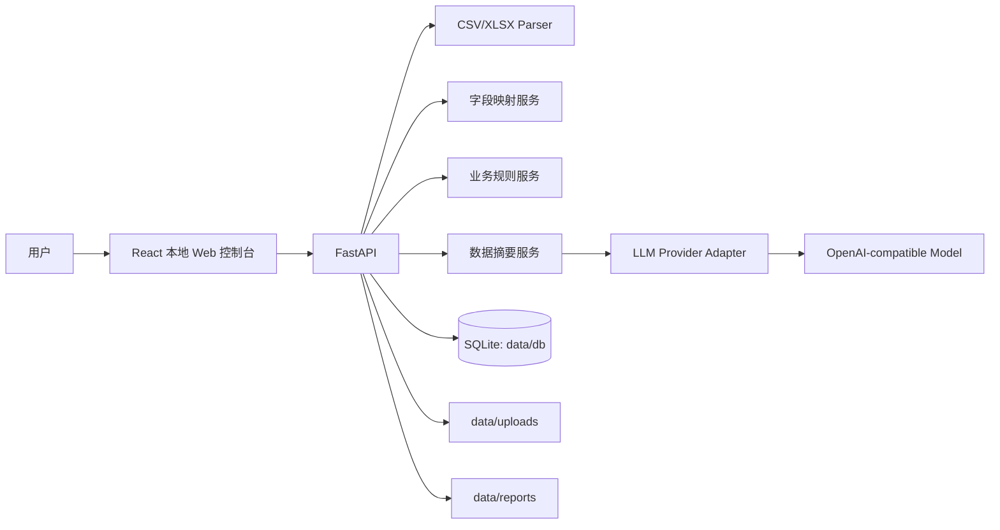

# GyuTron Local Agent 技术架构文档

## 1. 架构目标

GyuTron Local Agent 是 local-first 的企业 AI 业务 Agent。第一版只实现本地 Excel/CSV 导入、字段映射、模型配置、业务规则、本地报告生成和历史报告查看的基础能力。

架构必须满足：

- 客户业务数据默认保存在本地。
- 模型 API Key 由客户自行配置。
- 第一版只支持 OpenAI-compatible API。
- 第一版只读数据，不执行危险动作。
- 模块边界清晰，便于后续扩展 Claude、Gemini、Ollama 和平台 API。

## 2. 技术栈

- Frontend: React + Vite + TypeScript
- Backend: Python FastAPI
- Database: SQLite
- File parsing: pandas + openpyxl
- Deployment: Docker Compose
- Local storage:
  - `data/uploads`
  - `data/reports`
  - `data/db`

## 3. 项目结构

```text
gyutron-local-agent/
  apps/
    api/
      app/
        main.py
        config.py
        database.py
        models/
        schemas/
        routers/
        services/
        parsers/
        llm/
        report/
      tests/
      requirements.txt
      Dockerfile
    web/
      src/
        pages/
        components/
        api/
        types/
      package.json
      Dockerfile
  data/
    uploads/
    reports/
    db/
  docs/
    PRD.md
    ARCHITECTURE.md
    API.md
    MVP_ROADMAP.md
  docker-compose.yml
  README.md
  AGENTS.md
```

`data/` 是本地运行数据目录，默认不提交到 Git。

## 4. 总体数据流



## 5. 后端模块

### 5.1 `main.py`

FastAPI 应用入口，负责：

- 注册路由。
- 启动时初始化本地目录和 SQLite。
- 暴露 `GET /health`。

### 5.2 `config.py`

集中读取配置：

- 数据目录。
- 数据库路径。
- CORS 设置。
- 本地运行环境。

不允许硬编码 API Key。

### 5.3 `database.py`

负责：

- 创建 `data/uploads`、`data/reports`、`data/db`。
- 初始化 SQLite。
- 提供数据库连接。

MVP 可以先用轻量 SQLite 初始化脚本，后续再引入 SQLAlchemy/Alembic。

### 5.4 `parsers/`

负责：

- CSV/XLSX 解析。
- 表头读取。
- 前 20 行预览。
- 数据类型粗略识别。

不得把完整大表直接返回前端或直接送给 LLM。

### 5.5 `services/`

负责业务逻辑：

- 上传文件保存。
- 字段自动猜测。
- 字段映射保存。
- 业务规则保存。
- 数据摘要生成。
- 历史报告读取。

### 5.6 `llm/`

LLM Provider Adapter 层。

第一版接口：

```python
class LLMProvider:
    def generate(self, messages: list[dict], model: str) -> str:
        ...
```

第一版只实现 OpenAI-compatible API：

- `POST {base_url}/chat/completions`
- Header: `Authorization: Bearer <api_key>`
- Body: `model`, `messages`, `temperature`

安全要求：

- 不在日志中打印 API Key。
- 报告快照中不保存完整 API Key。
- 只发送后端整理后的摘要，不发送完整原始表格。

### 5.7 `report/`

负责老板日报生成：

- 组装数据摘要。
- 注入业务规则。
- 调用 LLM Adapter。
- 保存 Markdown 报告。
- 写入 SQLite。

## 6. 数据库存储

SQLite 文件位置：

```text
data/db/gyutron.sqlite3
```

MVP 基础表：

- `uploads`
- `field_mappings`
- `business_rules`
- `llm_configs`
- `reports`

### 6.1 `uploads`

保存上传文件记录：

- 文件名。
- 数据类型。
- 本地路径。
- 文件大小。
- 解析状态。
- 创建时间。

### 6.2 `field_mappings`

保存字段映射：

- 上传文件 ID。
- 原始列名。
- 标准字段。
- 映射状态。
- 置信度。

### 6.3 `business_rules`

保存自然语言业务规则：

- 规则名称。
- 规则内容。
- 适用数据类型。
- 是否启用。
- 优先级。

### 6.4 `llm_configs`

保存模型配置：

- Provider 名称。
- Base URL。
- Model Name。
- API Key。
- 是否默认。

正式商用前需要加密 API Key。MVP 不允许在日志或报告快照中打印 API Key。

### 6.5 `reports`

保存历史报告：

- 标题。
- 状态。
- 报告 Markdown。
- 数据摘要快照。
- 业务规则快照。
- 模型配置快照，不含完整 API Key。
- 创建时间。

## 7. 前端模块

MVP 页面：

- Dashboard：本地服务状态和下一步入口。
- Upload：上传 CSV/XLSX。
- Mapping：字段映射。
- Model Settings：模型配置。
- Rules：业务规则。
- Generate Report：生成老板日报。
- Report History：历史报告。

第一阶段只需要前端能启动，并显示后端健康状态。

## 8. 本地部署

Docker Compose 服务：

- `api`: FastAPI 后端。
- `web`: Vite 前端。

本地目录挂载：

```yaml
./data:/app/data
```

## 9. 后续扩展

- Claude/Gemini/Ollama adapter。
- Alibaba/Shopee/Amazon/TikTok Shop API connector。
- 本地管理员密码。
- 报告导出 PDF。
- 企业微信/邮件通知。
- 多用户权限。
- 定时任务和自动化工作流。

