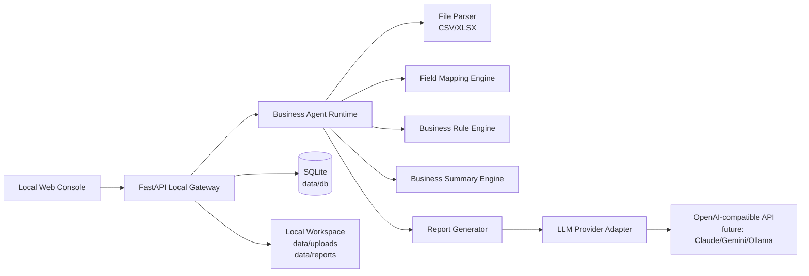

# OpenClaw 架构学习总结与 GyuTron 重构方案

研究对象：

- OpenClaw 官方文档：https://docs.openclaw.ai/
- OpenClaw Getting Started：https://docs.openclaw.ai/start/getting-started
- OpenClaw GitHub 仓库：https://github.com/openclaw/openclaw
- OpenClaw GitHub README、Docker 配置、源码目录。
- 本地研究快照：`openclaw/openclaw` commit `88c99ddf`。

本文件只总结架构思想，不复制 OpenClaw 代码、产品定位或 UI。

## 1. OpenClaw 架构学习总结

### 1.1 Local Gateway / Runtime

OpenClaw 的核心是一个长期运行的 Gateway。Gateway 是统一控制平面，负责：

- 维护渠道连接。
- 管理 session、routing、presence、health、heartbeat、cron 等事件。
- 对外提供 WebSocket API。
- 接收来自 Web UI、CLI、桌面端、移动节点和消息渠道的请求。
- 把请求路由到 agent runtime。

关键思想：

- Gateway 是“单一事实来源”，所有客户端都连接它。
- Runtime 不一定绑定 UI，UI 只是 Gateway 的一个控制面。
- Gateway 常驻运行，适合承载定时任务、后台任务和长会话。

对 GyuTron 的启发：

- 我们也需要一个本地常驻业务 runtime，但第一版不必引入 WebSocket 和多客户端协议。
- MVP 可以先让 FastAPI 承担 Gateway + Runtime 的角色。
- 后续如果要做定时日报、企业微信通知、平台 API 同步，再抽出独立 runtime/scheduler。

### 1.2 Model Provider Adapter

OpenClaw 使用 provider/model 引用来解耦模型选择，例如 `provider/model`。它支持：

- 默认模型。
- fallback 模型。
- provider auth。
- provider catalog。
- provider plugin。
- 本地模型服务，如 Ollama、LM Studio。

关键思想：

- 模型不是写死在业务逻辑里。
- Provider 是可配置、可替换、可探测的。
- 模型选择和模型调用应该与 agent/session 分离。

对 GyuTron 的启发：

- 第一版只做 OpenAI-compatible，但接口要按 provider adapter 设计。
- 数据库中保存 `provider_name`、`base_url`、`model_name`、`api_key`。
- 生成报告服务只依赖 `LLMProvider.generate()`，不直接依赖 OpenAI SDK。
- 未来扩展 Claude、Gemini、Ollama 时，不改报告生成业务逻辑。

### 1.3 Skills / Plugins

OpenClaw 区分 skill 和 plugin：

- Skill 更像 markdown 指令包，告诉 agent 何时如何使用某类工具。
- Plugin 是能力扩展边界，可以注册 provider、channel、tool、service、route 等能力。
- Plugin 通过 manifest 发现、校验、启用，再注册 capability。
- Capability 是核心契约，plugin 是实现和所有权边界。

关键思想：

- 能力扩展不应该散落在核心业务代码里。
- 插件应该声明自己提供什么能力。
- 先定义 capability contract，再让不同插件实现。
- Skill 可以作为轻量业务知识和操作说明，不一定都是代码。

对 GyuTron 的启发：

- MVP 不做完整插件市场。
- 但可以从一开始预留“业务能力模块”的形状：
  - `file_source`：Excel/CSV 导入。
  - `field_detector`：字段识别。
  - `report_template`：报告模板。
  - `business_rule`：规则解释与应用。
  - `llm_provider`：模型调用。
- 后续平台 API Connector 可以按 plugin/capability 模式加入，而不是写进核心报表服务。

### 1.4 Local Workspace

OpenClaw 有 workspace 概念，用来保存 agent 的上下文、技能、记忆和工作文件。配置、凭证、session 状态与 workspace 分离。

关键思想：

- workspace 是 agent 的工作目录和本地记忆。
- 配置、凭证、运行状态不要混在业务文件里。
- workspace 可备份、迁移，但不能提交 secrets。

对 GyuTron 的启发：

- 我们的 workspace 不是个人助理记忆，而是企业本地业务记忆。
- 建议目录分层：
  - `data/uploads`：原始上传文件。
  - `data/reports`：报告文件。
  - `data/db`：SQLite。
  - 后续 `data/workspace`：客户资料、产品资料、报告模板、业务规则导出。
  - 后续 `data/connectors`：平台连接器状态。
- 本地业务数据和模型凭证默认不进入 Git。

### 1.5 Task Scheduler

OpenClaw 的 cron 运行在 Gateway 内，定时任务、运行状态、历史记录持久化到 SQLite。它支持：

- one-shot。
- recurring interval。
- cron expression。
- timezone。
- isolated session。
- run history。
- retry / backoff。
- webhook delivery。

关键思想：

- scheduler 属于 runtime，而不是模型。
- 任务定义、运行状态、运行历史必须持久化。
- 定时任务需要隔离上下文，避免污染主会话。
- 任务失败要可追踪。

对 GyuTron 的启发：

- 第一版可以不做定时任务，但数据库表和服务边界应为后续定时日报留位置。
- 未来的“每天早上 8 点生成老板日报”应由本地 scheduler 执行，而不是前端触发。
- 报告生成任务需要状态：pending、running、succeeded、failed。

### 1.6 Docker 部署

OpenClaw Docker 设计重点：

- Gateway 长期运行。
- 配置、workspace、凭证目录挂载到宿主机。
- 容器内路径固定，避免宿主机路径泄漏进 runtime。
- `host.docker.internal` 用于连接宿主机上的 Ollama、LM Studio 等本地模型。
- healthcheck。
- 最小权限和安全选项。

关键思想：

- 容器是运行方式，不是数据归属。
- 持久化目录必须明确挂载。
- 本地模型在 Docker 内访问宿主机时需要特殊地址。
- 部署脚本要保护用户的本地状态。

对 GyuTron 的启发：

- Docker Compose 应挂载 `./data:/app/data`。
- 后端容器内使用固定 `GYUTRON_DATA_DIR=/app/data`。
- 后续支持 Ollama 时，Docker 文档要提示使用 `http://host.docker.internal:11434`。
- 应加入 API healthcheck 和 Web healthcheck。

### 1.7 Config / Onboarding

OpenClaw onboarding 负责引导用户完成：

- 模型和认证。
- workspace。
- Gateway 端口、绑定地址、认证。
- 渠道。
- daemon。
- health check。
- skills。

关键思想：

- 第一次启动要引导用户，而不是要求用户手改配置。
- QuickStart 和 Advanced 分层。
- 重跑 onboarding 不应破坏现有状态。
- secret 可以用引用方式管理，而不是直接落明文。

对 GyuTron 的启发：

- MVP 应做 Web onboarding，而不是 CLI onboarding。
- 第一次打开 Web 控制台时，按步骤引导：
  1. 本地数据目录确认。
  2. 模型 API 配置。
  3. 上传样例文件。
  4. 字段映射确认。
  5. 添加业务规则。
  6. 生成第一份老板日报。
- 高级配置后置，不打扰第一份报告生成。

## 2. 可以复用的架构思想

适合 GyuTron 复用思想的模块：

1. **单一本地控制平面**  
   用 FastAPI 作为本地控制平面，统一管理文件、模型、规则、报告、任务。

2. **Provider Adapter**  
   所有模型调用走 adapter，不让报告服务直接依赖某个供应商 SDK。

3. **Capability 边界**  
   后续平台 API、报表模板、字段识别、通知通道都按能力边界拆，不写成一团。

4. **本地 workspace / state 分离**  
   上传文件、报告、数据库、凭证、配置分层保存，便于备份和迁移。

5. **任务状态机**  
   报告生成、未来定时日报、未来平台同步都走任务状态，不做无状态黑盒调用。

6. **Docker 持久化目录**  
   容器可以重建，`data/` 必须持久。

7. **Onboarding 分步引导**  
   用户第一次使用时，直接带到“生成第一份报告”，而不是展示复杂配置中心。

## 3. 不适合 GyuTron 的模块

不适合第一版照搬的部分：

1. **多消息渠道 Gateway**  
   OpenClaw 面向 WhatsApp、Telegram、Slack、Discord 等多渠道聊天。GyuTron MVP 只需要本地 Web 控制台。

2. **复杂 WebSocket 协议**  
   我们第一版没有多端实时协同和节点连接需求，REST API 足够。

3. **个人助理 session 模型**  
   OpenClaw 的会话偏个人助手和聊天上下文。GyuTron 的核心对象是数据集、字段映射、业务规则、报告任务。

4. **全能力工具执行**  
   OpenClaw 可执行 shell、浏览器、文件操作。GyuTron 第一版必须 read-only，不自动执行危险动作。

5. **插件市场和第三方任意插件**  
   企业本地业务系统更重视稳定和安全。第一版应使用内置模块，不开放任意插件执行。

6. **复杂 sandbox**  
   GyuTron MVP 没有执行外部代码的需求，先不引入 Docker sandbox。

7. **语音、Canvas、移动节点**  
   与老板日报 MVP 无关。

8. **多 agent routing**  
   第一版不做多 Agent。后续可以引入“销售 Agent”“运营 Agent”“库存 Agent”，但现在不需要。

## 4. GyuTron Local Agent 重构架构方案

### 4.1 总体架构



### 4.2 后端模块建议

当前已有基础：

```text
apps/api/app/
  main.py
  config.py
  database.py
  routers/
  services/
  parsers/
  llm/
  report/
```

建议重构为：

```text
apps/api/app/
  core/
    config.py
    database.py
    security.py
    logging.py
  routers/
    health.py
    uploads.py
    mappings.py
    llm_configs.py
    rules.py
    reports.py
    jobs.py
  services/
    upload_service.py
    mapping_service.py
    rule_service.py
    report_service.py
    job_service.py
  parsers/
    tabular_parser.py
    schema_detector.py
  llm/
    base.py
    openai_compatible.py
    factory.py
  report/
    summary_builder.py
    prompt_builder.py
    boss_daily_template.md
  workspace/
    paths.py
    storage.py
```

### 4.3 核心对象

GyuTron 不以 chat session 为核心，而以业务对象为核心：

- `DatasetUpload`
- `FieldMapping`
- `BusinessRule`
- `LLMConfig`
- `ReportJob`
- `Report`
- 后续：`Connector`, `Schedule`, `NotificationTarget`

### 4.4 Local Gateway 的 MVP 形态

MVP 中 FastAPI 就是 Local Gateway：

- 提供 REST API。
- 初始化本地目录和 SQLite。
- 管理模型配置。
- 管理上传和字段映射。
- 触发报告任务。
- 提供报告历史。

后续演进：

- 当需要定时任务、平台同步、通知时，增加 `runtime_worker`。
- 当需要实时进度时，再引入 WebSocket 或 Server-Sent Events。

### 4.5 Provider Adapter

第一版接口：

```python
class LLMProvider:
    def generate_report(self, messages: list[dict], config: LLMConfig) -> str:
        ...
```

实现：

- `OpenAICompatibleProvider`

未来：

- `ClaudeProvider`
- `GeminiProvider`
- `OllamaProvider`

安全规则：

- 不硬编码 API Key。
- 不打印 API Key。
- 报告快照不保存完整 API Key。
- LLM 输入只使用摘要，不使用完整原始表格。

### 4.6 业务 Skills 的替代设计

不做 OpenClaw 式任意 skills。改成“受控业务能力包”：

```text
apps/api/app/business_capabilities/
  inquiry/
    fields.py
    summary.py
    rules.py
  order/
    fields.py
    summary.py
    rules.py
  product/
    fields.py
    summary.py
    rules.py
  inventory/
    fields.py
    summary.py
    rules.py
```

每个能力包声明：

- 支持的数据类型。
- 标准字段。
- 字段识别规则。
- 摘要指标。
- 可程序化执行的规则。

自然语言业务规则先保存并注入 prompt，后续再逐步结构化。

### 4.7 Scheduler 设计

MVP 暂不实现自动调度，但先设计表：

- `jobs`
- `job_runs`

报告生成使用 `ReportJob` 状态流：

```text
pending -> running -> succeeded
pending -> running -> failed
```

0.6 阶段先同步执行，0.8 后引入后台 worker。

### 4.8 Onboarding 设计

第一版 Web onboarding：

1. 欢迎页：说明 local-first 和外部模型摘要发送边界。
2. 模型配置：Base URL、API Key、Model Name。
3. 上传数据：选择数据类型并上传文件。
4. 字段映射：确认系统猜测。
5. 业务规则：添加 1-3 条规则。
6. 生成报告：得到第一份老板日报。

## 5. 第一阶段可执行开发计划

### Step 1：重构基础目录

目标：

- 将 `config.py`、`database.py` 移入 `core/`。
- 增加 `workspace/paths.py`。
- 保持 `/health` 不破坏。

验收：

- 后端测试通过。
- 前端仍能读取 `/health`。

### Step 2：上传与预览

目标：

- `POST /uploads`
- `GET /uploads/{id}/preview`
- 支持 CSV/XLSX。
- 保存文件到 `data/uploads`。
- 写入 `uploads` 表。

验收：

- 前端可上传文件。
- 页面展示表头和前 20 行。
- SQLite 有上传记录。

### Step 3：字段识别与映射

目标：

- 建立标准字段字典。
- 规则化识别客户名、国家、产品、金额、时间、状态、销售员。
- `POST /mappings`
- 映射保存到 SQLite。

验收：

- 用户可确认和修改字段映射。
- 映射刷新后不丢。

### Step 4：模型配置

目标：

- `POST /llm-configs`
- `GET /llm-configs`
- `POST /llm-configs/{id}/test`
- 实现 OpenAI-compatible adapter。

验收：

- API Key 不进入日志。
- 可保存模型配置。
- 可测试连接。

### Step 5：业务规则

目标：

- `POST /rules`
- `GET /rules`
- `PATCH /rules/{id}`
- `DELETE /rules/{id}`

验收：

- 规则保存到 SQLite。
- 生成报告时能加载启用规则。

### Step 6：老板日报生成

目标：

- 根据数据集、字段映射、业务规则构建摘要。
- 调用 LLM adapter。
- 保存报告到 SQLite 和 `data/reports`。

验收：

- 报告包含老板摘要、核心数据变化、异常提醒、高优先级客户、产品机会、国家/市场趋势、销售跟进任务、风险点、下一步建议。

### Step 7：历史报告

目标：

- `GET /reports`
- `GET /reports/{id}`
- 前端报告列表和详情页。

验收：

- 用户可以查看历史报告。
- 报告可追溯使用的数据摘要和规则快照。
